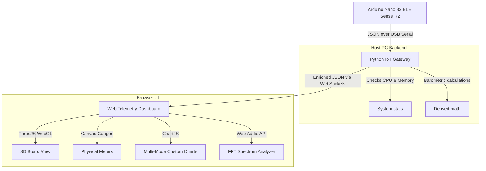

# Arduino Nano 33 BLE Sense Rev2 Telemetry Dashboard

A production-grade, real-time telemetry dashboard for the **Arduino Nano 33 BLE Sense Rev2**. The board continuously streams raw environmental, IMU, gesture, and audio data over USB CDC Serial in JSON format. The Python FastAPI backend acts as an IoT gateway, parses and enriches the data, and broadcasts it over WebSockets. The responsive glassmorphism web panel renders 3D board rotations, line charts, radial gauges, and a diagnostic scrolling console.

---

## System Architecture



---

## Key Features

1. **Space Telemetry Aesthetics**: Sleek dark-mode glassmorphic cards with responsive sidebars.
2. **Three.js 3D Orientation**: Calculates pitch, roll, and tilt-compensated compass yaw to orient a detailed 3D model of the board.
3. **Environment HUD**: Live temperature, humidity, pressure, and barometric altitude dials with sparklines and max/min/average statistics.
4. **Spectral Microphone**: Dual input modes supporting either PDM RMS metrics from the board or a high-fidelity Web Audio API microphone stream directly in the browser.
5. **Interactive Charts**: Custom real-time Chart.js rendering (Line, Scatter, Histogram, Area) with zoom sliders, CSV buffer exports, and PNG canvas captures.
6. **Diagnostics Panel**: Scrolling raw serial console, bandwidth calculator, and color-coded JSON formatting inspector.
7. **Virtual Simulation Mode**: When no board is connected, the gateway auto-reconnects to a mock stream simulating realistic physics waves, gestures, and audio.

---

## Installation & Setup

### 1. Prerequisites
Ensure you have the following installed on your machine:
- [Python 3.10+](https://www.python.org/downloads/)
- [Arduino IDE](https://www.arduino.cc/en/software)

### 2. Dependency Configuration
Clone or navigate to the project directory and install the Python dependencies:
```bash
pip install -r requirements.txt
```

### 3. Flash Arduino Firmware
1. Connect the **Arduino Nano 33 BLE Sense Rev2** to your PC using a micro-USB cable.
2. Open the Arduino IDE.
3. Install the required board package:
   - Go to **Tools > Board > Boards Manager**.
   - Search for **"Arduino Mbed OS Nano Boards"** and install the latest version.
4. Install the following libraries via the Library Manager (**Sketch > Include Library > Manage Libraries**):
   - `Arduino_BMI270_BMM150`
   - `Arduino_HS300x`
   - `Arduino_LPS22HB`
   - `Arduino_APDS9960`
5. Open the firmware sketch located at `arduino/sensor_stream.ino`.
6. Select your board (**Tools > Board > Arduino Mbed OS Nano Boards > Arduino Nano 33 BLE**) and the corresponding COM port.
7. Click **Upload** to compile and flash the firmware.

---

## Execution Guide

### 1. Run the Python IoT Gateway
Start the FastAPI server using Uvicorn from the root directory:
```bash
python -m uvicorn backend.main:app --host 127.0.0.1 --port 8000
```

### 2. Access the Dashboard
Open your web browser and navigate to:
```
http://127.0.0.1:8000
```
The FastAPI server serves the static frontend assets from the root path, meaning the dashboard is completely self-contained.

---

## REST API Reference

The backend exposes REST endpoints for dashboard integrations:

- **`GET /api/ports`**: Returns a list of all active serial ports on the host machine.
- **`POST /api/connect`**: Command the gateway to close the active link and open a new target COM port.
  - *Payload*: `{"port": "COM3", "baudrate": 115200}`
- **`GET /api/status`**: Checks connection metadata, active ports, mock states, and packet drop tracking.
- **`WS /ws`**: Primary WebSocket route for real-time JSON telemetry broadcasting.

---

## Troubleshooting & FAQ

#### The dashboard displays "SIMULATED TELEMETRY" and the board values are static.
The Python gateway did not detect a streaming Arduino and fell back to the mock simulator to allow testing. Check that the board is plugged in, flash the `sensor_stream.ino` code again, and navigate to the **Settings** tab in the dashboard to scan and connect to the correct physical port (e.g. `COM4` or `/dev/ttyACM0`).

#### The 3D board does not rotate.
Ensure the **IMU & Fusion** tab is open. Verify the console logs to see if there are WebGL/Three.js errors. The board calculates heading from the magnetometer; keep the sensor clear of metallic interference or magnets for correct tilt compensation.

#### Microphone visualizer is a flat line.
In **Browser Mic** mode, the browser will request permission to capture audio. Ensure you accept the request. If you are in **Arduino Sensor** mode, confirm that PDM microphone initialization did not fail during boot by inspecting the **System** tab's boot logs.
